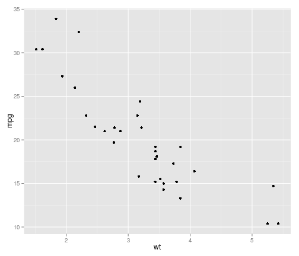

## Read-And-Delete

1. Edit YAML front matter
2. Write using R Markdown
3. Use an empty line followed by three dashes to separate slides!

--- .class #id 

## Slide 2
Stupid Test test

 kgfkdfkdkafd

--- .class #id

## Slide 4

The stupid stuff is hjere

--- #montreal bg:url(http://blogit.jamk.fi/newyorkminute/files/2012/03/Blog-Montreal2.jpg)

 ## Montreal by Night Time

---  plot #simple-plot

## A Simple Plot ##

Let us create a simple scatterplot.


```r
require(ggplot2)
qplot(wt, mpg, data = mtcars)
```




---  Viudeo

## Video

<iframe width="420" 
height="315" src="//www.youtube.com/embed/I95GOmLc7TA" 
frameborder="0" allowfullscreen></iframe>
